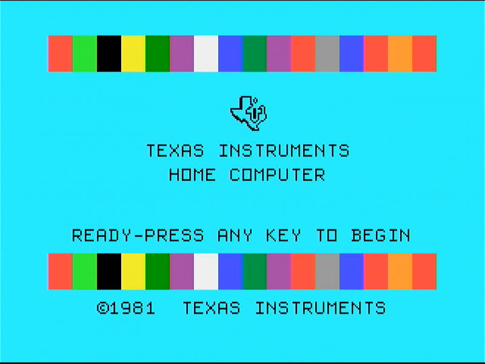
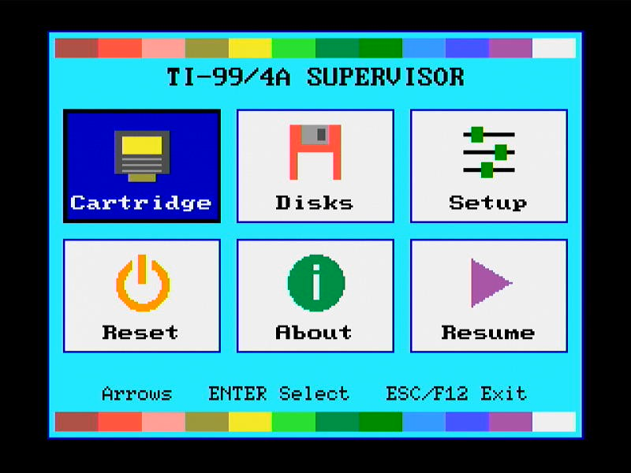

# Classic99 ESP32 — a TI-99/4A on the TTGO VGA32

This repository is a fork of [Classic99](https://github.com/tursilion/classic99),
the Windows TI-99/4A emulator by Mike Brent ("Tursi"), with a port to the
**ESP32** added in the [`esp32/`](esp32/) directory.

The port turns a TTGO VGA32 v1.4 board into a standalone TI-99/4A: plug in a
VGA monitor, a PS/2 keyboard and an SD card with the TI ROMs, and it boots
straight to the TI title screen.

  
  

<em>Boot to the TI title screen, and the Supervisor menu (F12)</em>

**Everything about the ESP32 port is in [`esp32/README.md`](esp32/README.md).**

| I want to... | Go to |
|---|---|
| See what is emulated and what has been tested | [Features](esp32/README.md#features) |
| See it running | [Screenshots](esp32/README.md#screenshots) |
| Know which board and parts I need | [Hardware](esp32/README.md#hardware) |
| Build and flash the firmware | [Building and flashing](esp32/README.md#building-and-flashing) |
| Prepare the SD card (ROMs, cartridges, disks) | [SD card](esp32/README.md#sd-card) |
| Use the keyboard, joystick and F12 menu | [Keyboard](esp32/README.md#keyboard), [Supervisor menu](esp32/README.md#supervisor-menu-f12) |
| Load it from ESP32_Bootloader | [Standalone and ESP32_Bootloader builds](esp32/README.md#standalone-and-esp32_bootloader-builds) |
| Read the code | [Source layout](esp32/README.md#source-layout) |
| See what is planned | [`esp32/TODO.md`](esp32/TODO.md) |

No TI ROMs, cartridges or disk images are needed from this repository to use
the port; you copy your own to the SD card.

## About this fork

- All the code of the port is in `esp32/`. Everything outside it is the
  Classic99 source, unchanged except for this readme, and is kept as the
  reference the port is derived from (the CPU core is generated from
  `console/cpu9900.cpp`).
- The port is published with the permission of Mike Brent, as Classic99's
  licence requires. It remains under that licence; see
  [Licence](esp32/README.md#licence) for details and for the separate
  BSD 3-Clause licence of the speech synthesiser code.
- For the Windows emulator itself, use the original repository:
  <https://github.com/tursilion/classic99>.

---

## Classic99 (original readme)

399.092

Open source (but restrictive license) emulator including ROMs licensed by Texas Instruments - see [documentation](https://github.com/tursilion/classic99/raw/main/dist/Classic99%20Manual.pdf) for license and restrictions.

Tips and tricks video: [https://www.youtube.com/watch?v=6Zok8TZLIP8](https://www.youtube.com/watch?v=6Zok8TZLIP8)
